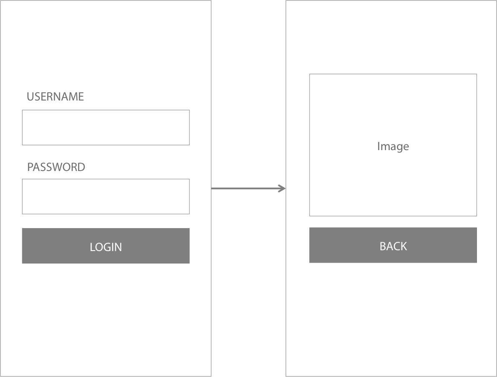

# iOS Developers

#### Time: 1 hour

Thanks for your interest in Altitude Labs. 

We have designed a short exercise to assess how you would go about coding in your day-to-day job. We are looking for more than just working code: comments, good structure and an understanding of how to test your code. You are free to use Google and the internet and encouraged to make use of your interviewers should you get stuck or have any questions.

1. Create an app that initially displays a form with controls to enter a username and password and submit the form. When the form is submitted ensure: The username is at least 8 characters in length and alphabetic The password is at least 8 characters in length
2. If the info in the form is valid, navigate to another page and display an image and a button to return to the previous screen. When tapped the image should show a message saying "Hello World"

